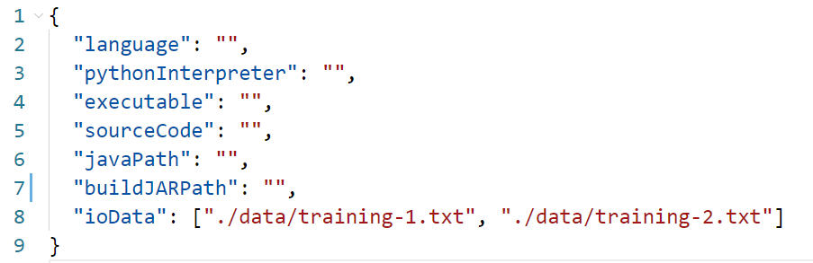
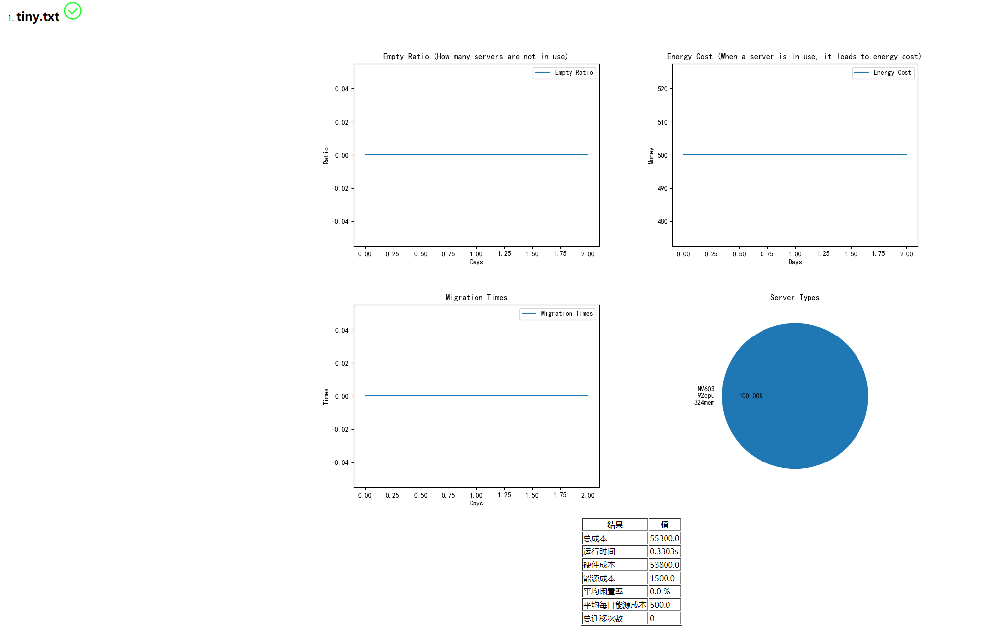

# AutoGrader

- **0.2.0更新**：加入资源分配溢出检测，如果发生资源溢出会输出溢出发生的位置。

  - 如果通过检测，会显示通过符号

    

  - 如果没有通过检测，会显示警告，并输出溢出发生的位置和操作，比如：
  
- 0.2.1更新：溢出信息更详细

  - 
  
- 0.2.2更新：可以对java程序输出分析了，详见下述食用方法。

- 0.2.4更新：由于最后生成的报告需要浏览器来查看，Linux下可能无法打开报告，请将目录下生成的最新一份html和resource文件夹拷贝到Windows下使用浏览器打开html文件浏览。

- 0.2.5更新：默认python路径会导致一个bug，现在已经修复，感谢Yjh-Rking的反馈。

- **0.3.0更新**：

  - 加入迁移次数检测，按照比赛规则每天迁移次数不应超过总虚拟机数量的千分之五。
  - 修改Java程序分析逻辑，现在应该不会再有奇怪的除0了。感谢BlankMan参与测试及提出建议。
  - 图片标题改用英文，避免字体导致的乱码。
  - 新增不同平台的tips。
  - config已改动，使用以前版本的config将导致错误，请使用新版config并遵照食用方法给出的说明填写。
  
- 0.3.1更新：新增了两种错误提示，包括服务器部署时试图在不存在的ID上部署和迁移时出现迁移到不存在的ID。

- 0.3.2更新：修改了一个换行符会导致的bug，新增一种错误提示。

**网页不再使用index.html的统一名称，改为当前时间戳，方便保存对比。**

## 1.说明

本程序仅用以分析2021华为软件精英挑战赛的个人程序输出结果，不得用于商业用途，仅做学习交流。

## 2.食用方法

1. Clone本项目到本地

2. 使用你的文本编辑器（记事本、NotePad++、VSCode等）打开目录中的`config.json`文件，你将看到以下内容：

   

   字段意义：

   - **language**：你所使用的语言，请从[c,c++,python,java]中选择一个填入。
   - **pythonInterpreter**：如果language为python，请指定python解释器路径，留空则为默认python解释器，建议使用pypy并指定路径而不是Cpython。
   - **executable**：如果language为c或c++，请给出编译后的可执行文件(exe)的路径。
   - **sourceCode**：如果language为python，请给出python脚本所在的路径。
   - **javaPath**：如果language为java，请给出java路径，如果留空则为默认java。请在cmd中键入“java -version”来检查是否存在默认java解释器。
   - **buildJARPath**：如果language为java，请给出你使用比赛给出的build.sh文件构建出的jar文件路径，也就是bin文件夹中的那个CodeCraft-2021.jar的位置。
   - **ioData**：输入文件，以列表形式存在，其中每一个字符串为一个输入文件。

3. 

   如果你是C/C++选手，请在**language**中填入c++，然后在**executable**字段中给出编译后的可执行文件所在路径，并修改你的程序接受的输入文件所在的位置，填入到**ioData**字段中。

   如果你是Python选手，请在**language**中填入python，然后在**PythonInterpreter**中指定解释器或留空，留空则为默认python解释器。在**sourceCode**字段填入你的python脚本所在路径，并给出程序接收的输入文件。

   如果你是Java选手，请在**language**中填入java，然后在javaPath中指定java路径或留空，留空则使用默认java解释器。在**buildJARPath**字段中填入你使用比赛SDK中build.sh生成的jar的位置，一般情况下它位于build.sh同级目录下的bin文件夹中，名为**CodeCraft-2021.jar**，并给出程序接受的输入文件。

   **注意：**

   **所有路径应当使用一个/或者\\\来避免转义，并遵循JSON格式。**

   **如果使用相对路径，请使用./开头**

   **程序从标准输入输出获取信息，请不要重定向输入输出，仅在ioData字段中给出你想要输入到程序的文件路径即可**

   **程序从标准输入输出获取信息，请不要重定向输入输出，仅在ioData字段中给出你想要输入到程序的文件路径即可**

   **程序从标准输入输出获取信息，请不要重定向输入输出，仅在ioData字段中给出你想要输入到程序的文件路径即可**

4. config编辑完成后，在你clone下来的本文件夹中打开cmd并运行`pip install -r requirements.txt`来安装autoGrader需要的依赖。

5. 运行`autograder.py`，你可以选择使用IDE来运行或者直接在命令行中键入`python autograder.py`来运行

### 结果实例

`autograder`运行结束后将在当前路径生成index.html并**自动使用Chrome**打开，你将看到类似的页面

## 3.其他说明

1. 如果你使用的是Windows，默认情况下程序会使用Chrome打开报告，但如果你没有安装Chrome或者打开失败，请手动使用浏览器打开autograder同级目录下生成的最新html来查看报告，网页以时间戳命名。
2. 如果你使用的是Linux，html的排版有概率出现问题，如果出现排版和乱码问题，请尝试将html和resource文件夹拷贝到Windows平台查看。
3. 欢迎提交PR及issue。